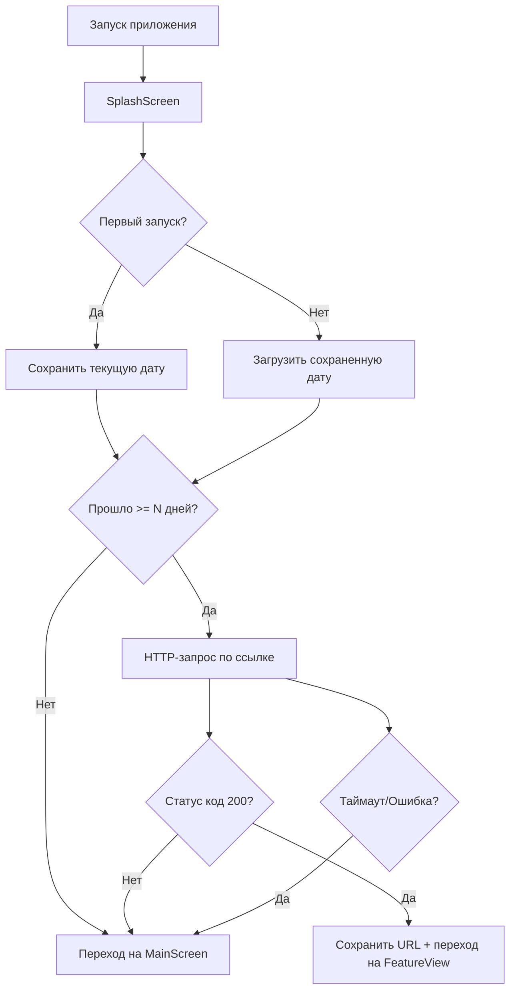

# Splash Screen с временной логикой и HTTP-проверкой

## ⚠️ TODO - Необходимые изменения для интеграции

### FEATURE VIEW
```dart
final prefs = await SharedPreferences.getInstance(); //TODO переделать под вашу конфигурацию
```

### SPLASH VIEW
```dart
void _navigateToMainScreen() {
  if (mounted) {
    Navigator.pushReplacementNamed(context, '/main'); //TODO ваша реализация
  }
}

void _navigateToFeatureView() {
  if (mounted) {
    Navigator.pushReplacementNamed(context, '/feature'); //TODO ваша реализация
  }
}
```

---

## Обзор

Данный функционал реализует splash screen с проверкой временного интервала и HTTP-запросом для условной навигации пользователя. Система определяет, на какой экран направить пользователя в зависимости от времени использования приложения и доступности удаленного ресурса.

## Архитектура

### Структура файлов

```
lib/
├── splash_screen.dart          # Основная логика splash screen
├── feature_mixin.dart          # Миксин для работы с конфигурацией
├── feature_data.dart           # Конфигурация и константы
├── preferences_service.dart    # Сервис для работы с SharedPreferences
├── feature_view.dart          # WebView экран
└── main.dart                  # Точка входа приложения
```

### Ключевые компоненты

1. **SplashScreen** - основной экран загрузки с логикой маршрутизации
2. **ConfigManager** - централизованное управление конфигурацией
3. **AppStorage** - единый интерфейс для работы с SharedPreferences
4. **ConfigMixin** - миксин для доступа к конфигурации и хранилищу

## Логика работы

### Алгоритм принятия решений



### Временная логика

1. **Первый запуск**: Сохраняется текущая дата в SharedPreferences
2. **Последующие запуски**: Вычисляется разница между текущей датой и датой первого запуска
3. **Проверка условий**: Если прошло меньше N дней - переход на MainScreen
4. **Активация функции**: Если прошло >= N дней - выполняется HTTP-запрос

## Внедрение в проект

### 1. Добавление зависимостей

```yaml
# pubspec.yaml
dependencies:
  flutter:
    sdk: flutter
  shared_preferences: ^2.2.2
  http: ^1.1.0
  webview_flutter: ^4.4.2
  webview_flutter_wkwebview: ^3.9.4
```

### 2. Настройка конфигурации

```dart
// feature_data.dart
class ConfigManager {
  ConfigManager._internal();
  static final ConfigManager instance = ConfigManager._internal();

  // 🔗 НАСТРОЙКА ССЫЛКИ
  String get configData => 'https://your-api-endpoint.com/check';
  
  // ⏰ НАСТРОЙКА КОЛИЧЕСТВА ДНЕЙ
  int get waitingDays => 7;
}
```

### 3. Интеграция в main.dart

```dart
// main.dart
import 'package:flutter/material.dart';
import 'splash_screen.dart';
import 'feature_view.dart';

void main() {
  runApp(MyApp());
}

class MyApp extends StatelessWidget {
  @override
  Widget build(BuildContext context) {
    return MaterialApp(
      title: 'Flutter App',
      home: SplashScreen(), // 🚀 Устанавливаем splash как стартовый экран
      routes: {
        '/main': (context) => MainScreen(),
        '/feature': (context) => FeatureView(),
      },
    );
  }
}
```

### 4. Копирование файлов

Скопируйте следующие файлы в папку `lib/`:

- `splash_screen.dart`
- `feature_mixin.dart`
- `feature_data.dart`
- `preferences_service.dart`
- `feature_view.dart`

## Конфигурирование

### Настройка ссылки и дней

```dart
// feature_data.dart
class ConfigManager {
  // 🔗 Изменить ссылку для HTTP-запроса
  String get configData => 'https://your-domain.com/api/check';
  
  // ⏰ Изменить количество дней ожидания
  int get waitingDays => 3; // Например, 3 дня вместо 7
}
```

### Настройка таймаута

```dart
// splash_screen.dart - метод _checkFeatureAvailability()
final response = await http.get(
  Uri.parse(link),
  headers: {'Content-Type': 'application/json'},
).timeout(const Duration(seconds: 15)); // 🕐 Изменить таймаут
```

## Принцип работы с link и days

### Link (Ссылка)

```dart
// Получение ссылки через ConfigMixin
String get link => targetData; // Берется из ConfigManager.configData

// Использование в HTTP-запросе
final response = await http.get(Uri.parse(link));

// Сохранение для FeatureView
if (response.statusCode == 200) {
  saveLastVisitedUrl(link); // Сохраняется в SharedPreferences
}
```

### Days (Дни ожидания)

```dart
// Получение количества дней
int get days => ConfigManager.instance.waitingDays;

// Проверка временного интервала
bool get isTimeEnabled {
  if (_startDay == null) return false;

  final now = DateTime.now();
  final difference = now.difference(_startDay!).inDays;
  return difference >= days; // Сравнение с настроенным количеством дней
}
```

## Сценарии использования

### Сценарий 1: Первые дни использования
- Пользователь открывает приложение первый раз
- Сохраняется дата первого запуска
- Переход на MainScreen (обычный функционал)

### Сценарий 2: Прошло достаточно времени
- Пользователь открывает приложение через N дней
- Выполняется HTTP-запрос по настроенной ссылке
- При успешном ответе (200) - переход на FeatureView
- При ошибке - переход на MainScreen

## Отладка и мониторинг

### Проверка сохраненных данных

```dart
// Проверка даты первого запуска
final prefs = await SharedPreferences.getInstance();
final startDay = prefs.getString('start_day');
print('Дата первого запуска: $startDay');

// Проверка последнего посещенного URL
final lastUrl = prefs.getString('last_visited_url');
print('Последний URL: $lastUrl');
```

### Сброс данных для тестирования

```dart
// Сброс даты первого запуска
final prefs = await SharedPreferences.getInstance();
await prefs.remove('start_day');
await prefs.remove('last_visited_url');
```

## Особенности реализации

### Безопасность
- Обработка ошибок сети и таймаутов
- Проверка `mounted` перед навигацией
- Fallback на MainScreen при любых ошибках

### Производительность
- Минимальные вычисления в UI потоке
- Единый экземпляр ConfigManager (Singleton)
- Кэширование SharedPreferences

### Расширяемость
- Централизованная конфигурация
- Модульная архитектура
- Легкая настройка параметров

## Возможные модификации

1. **Добавление дополнительных условий**: Проверка версии приложения, региона пользователя
2. **Расширение конфигурации**: Добавление новых параметров в ConfigManager
3. **Улучшение UI**: Кастомизация splash screen, добавление анимаций
4. **Аналитика**: Логирование переходов и решений маршрутизации

## Заключение

Данный функционал обеспечивает гибкое управление пользовательским опытом на основе времени использования приложения и доступности удаленных ресурсов. Централизованная конфигурация позволяет легко настраивать поведение системы без изменения основного кода.